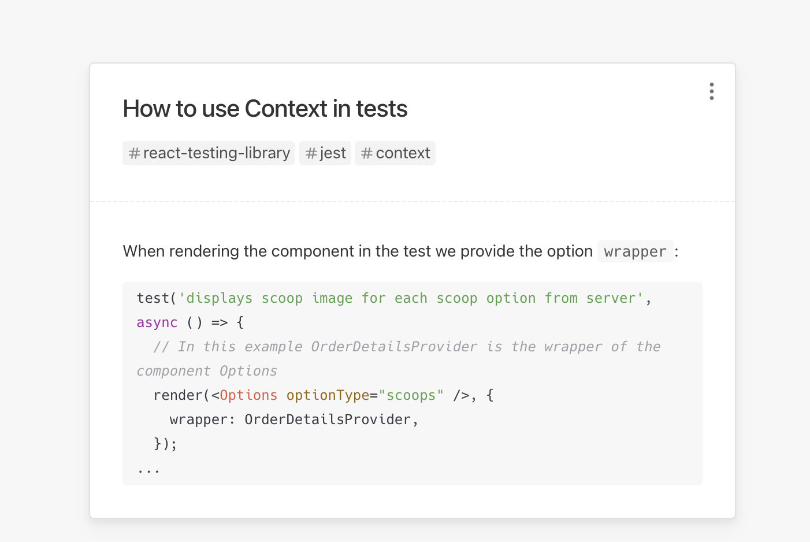

# 🧪 Testing: Sundaes on Demand

This is a <u>course project</u> focused on writing tests with **React Testing Library** and **Jest**. All tests were written following the ***Test Driven Development*** philosophy, which means they were written before the actual code of this simple app was written. 

The purpose of this exercise was to ==learn how to write tests using React Testing Library== so the app is pretty simple and not very stylish :nail_care: 

## Project review

<!-- My thoughts on the course -->

This course taught by the extraordinary teacher 👩🏻‍💻 [Bonnie Schulkin](https://github.com/bonnie) is a very recommended introduction to testing React applications with Jest and React Testing Library. The teacher is surprisingly clear in her explanations, giving enough depth to the concepts, which is appreciated by curious learners like myself. [🔗Link to her course in Udemy](https://www.udemy.com/course/react-testing-library/). I'm a great fan of Bonnie and I highly recommend you any of her courses.

<!-- Index to things related to the course -->

- About the project
- Main takeaways from the course
- Mochi deck

---

## About the project

The application tested in the course is a simple :ice_cream: ice cream order application where the user can select how many scoops of ice cream and what toppings they want for their ice cream. 

After selecting the ice cream and clicking on the order button, the user is shown a component displaying the order summary and a checkbox to accept terms and conditions as well as a button to send the order to the server. 

Once the order has been sent to the server, a random order number is sent back and displayed on the screen.  

## Main takeaways from the course

- React Testing Library encourages you to write **functional tests** and find elements by **accessibility markers**.
- **React Testling Library** provides a **virtual DOM** for tests (it helps with rendering components, searching the virtual DOM and interacting with it) whereas **Jest** is a **test runner** (responsible for finding, running tests and determining whether tests pass or fail).
- React Testing Library **basic syntax** (`render()`, `screen`) and the importance of finding elements by **accessibility handles** rather than by id.
- Differences between **functional testing** and **unit testing**.
- Differences between a **formatter** and a **linter**. Using testing-library and jest-fom eslint plugins.
- Be aware of using `await findBy...` when something async is happening in our tests.
- Use **Mock Service Worker** to intercept network callks and return specified responses without actually making the network calls during the tests
  - If we want to mock an error response we have to **override** the Mock Service Worker response
- **Debugging tips**: how to run speficic tests only, skip others, print virtual DOM to the console, common errors in tests.
- The need to pass a **mock function** (`jest.fn()`) as a prop for components that require a function as a prop.
- Using **Context** in tests: how to wrap a particular component in a provider in a test vs how to globally wrap all components in a provider by creating our own **custom render** method.

## Mochi deck

I'm an absolute fan of Matt's [SRS](https://en.wikipedia.org/wiki/Spaced_repetition) application 🍡 [Mochi](https://mochi.cards/) and so I created a deck with the main concepts I learned from this course. Feel free to check it out! 

|  | Check out my [mochi deck](https://app.mochi.cards/decks/b25e9526-94e3-484e-89e2-5c200dd8ad4f/iDQEZUMm/Testing-React-with-Jest-and-Testing-Library) for this course! |
| ------------------------------- | ------------------------------------------------------------ |

